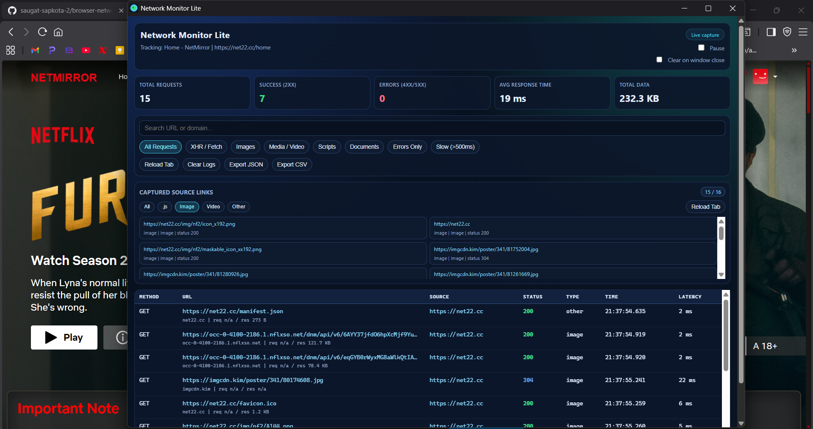
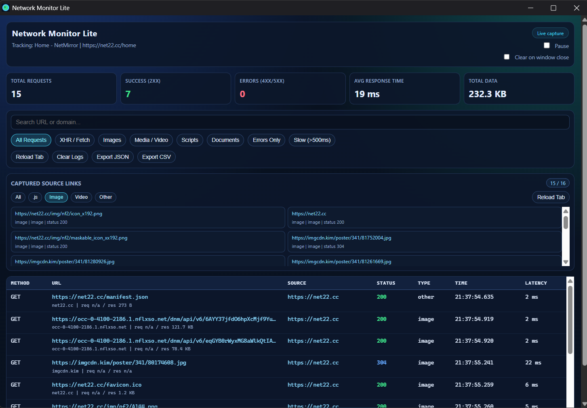

# Network Monitor Lite

Network Monitor Lite is a lightweight Chrome/Chromium extension that captures and displays network activity for one monitored tab in real time.

It is designed for fast inspection during web debugging, QA checks, and API troubleshooting without opening DevTools.

## Developer

### reinF-(Saugat Sapkota)

Built with focus on real-world debugging speed, clean UX, and practical monitoring workflows.

## Preview





## Key Features

- Real-time request capture for the selected tab
- Clean dashboard with summary metrics:
  - Total requests
  - Success count (2xx)
  - Error count (4xx/5xx + request failures)
  - Average latency
  - Total transferred data (request + response size when available)
- Rich request table with:
  - Method
  - URL
  - Source URL (initiator/document when available)
  - Status
  - Type
  - Timestamp
  - Latency
- Filter tools:
  - Request type chips (XHR/Fetch, Images, Media, Scripts, Documents)
  - Errors only
  - Slow requests only (default threshold: 500 ms)
  - Search by URL or domain
- Captured source links panel with category filters:
  - All
  - JavaScript
  - Image
  - Video
  - Other
- Utilities:
  - Reload tracked tab
  - Clear logs
  - Export filtered results to JSON or CSV
  - Pause/resume capture
  - Optional auto-clear when monitor window closes

## Tab Ownership Behavior

- Monitoring starts for the tab where you click the extension action.
- Opening links in new tabs does not transfer monitoring ownership.
- Closing child/new tabs does not stop the monitor.
- Closing the monitored main tab ends the session and closes the monitor window.

## Project Structure

```text
extension/
  background.js   # Service worker: capture pipeline, tab ownership, state, messaging
  manifest.json   # MV3 extension manifest
  popup.html      # Monitor window layout
  popup.css       # UI styles
  popup.js        # UI rendering, filters, exports, interactions
  icon.png        # Extension icon
README.md
```

## Installation (Developer Mode)

1. Clone or download this repository.
2. Open Chrome (or another Chromium-based browser).
3. Go to chrome://extensions.
4. Enable Developer mode.
5. Click Load unpacked.
6. Select the extension folder:

```text
Downloads/extension
```

7. Pin the extension from the browser toolbar for quick access.

## How To Use

1. Open the website tab you want to monitor.
2. Click the extension icon.
3. The monitor window opens and binds to that tab.
4. Reload the tracked tab to capture startup/network bootstrap requests.
5. Use filters and search to narrow results.
6. Export JSON/CSV if needed.

## Permissions

The extension requests only the permissions required for network monitoring:

- storage: Persist logs/settings locally
- tabs: Resolve tracked tab metadata and support tab reload
- webRequest: Observe network request lifecycle
- host_permissions <all_urls>: Monitor requests across all visited HTTP/HTTPS domains

## Privacy

- No external backend calls are made by the extension.
- Data is stored locally in browser extension storage.
- Exports are generated locally on your machine.

## Technical Notes

- Manifest Version: 3
- Background model: Service worker
- Log retention is capped (default max logs: 500)
- Average latency and totals are computed from captured request lifecycle events
- Request/response sizes depend on available browser metadata (for example, Content-Length)

## Limitations

- Request/response bodies are not displayed.
- Some size values may be unavailable depending on server headers and browser-provided event details.
- Internal browser pages (for example chrome://) are excluded from tracking.

## Troubleshooting

If requests do not appear:

1. Confirm the monitor is bound to the expected tab.
2. Reload the tracked tab.
3. Ensure capture is not paused.
4. Clear filters (set to All Requests, remove Errors/Slow filters).
5. Reopen the monitor from the target tab to rebind ownership.

If the extension was updated during testing:

1. Reload the extension in chrome://extensions.
2. Reopen the monitor window from the target tab.

## Development

No build step is required. This project uses plain HTML, CSS, and JavaScript.

For iterative development:

1. Edit files in extension/.
2. Reload the extension from chrome://extensions.
3. Reopen the monitor window and test.

## License

Add your preferred license information here (for example MIT).